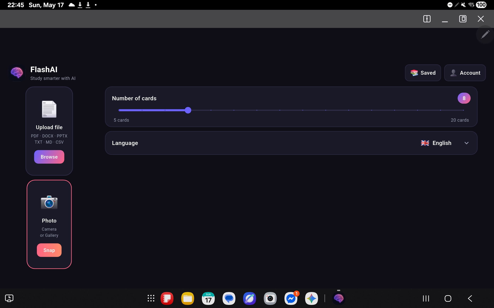
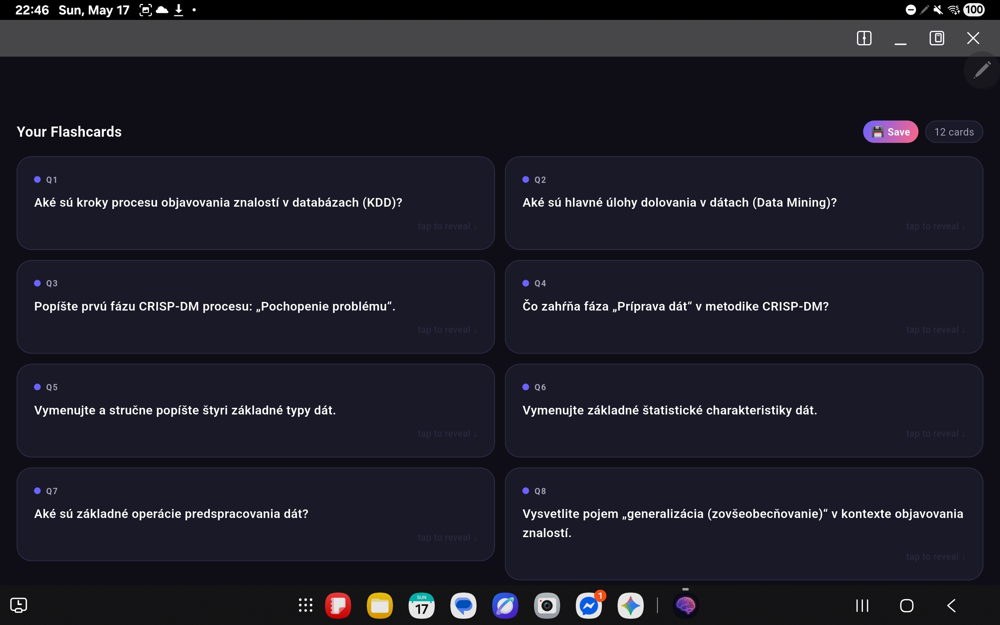
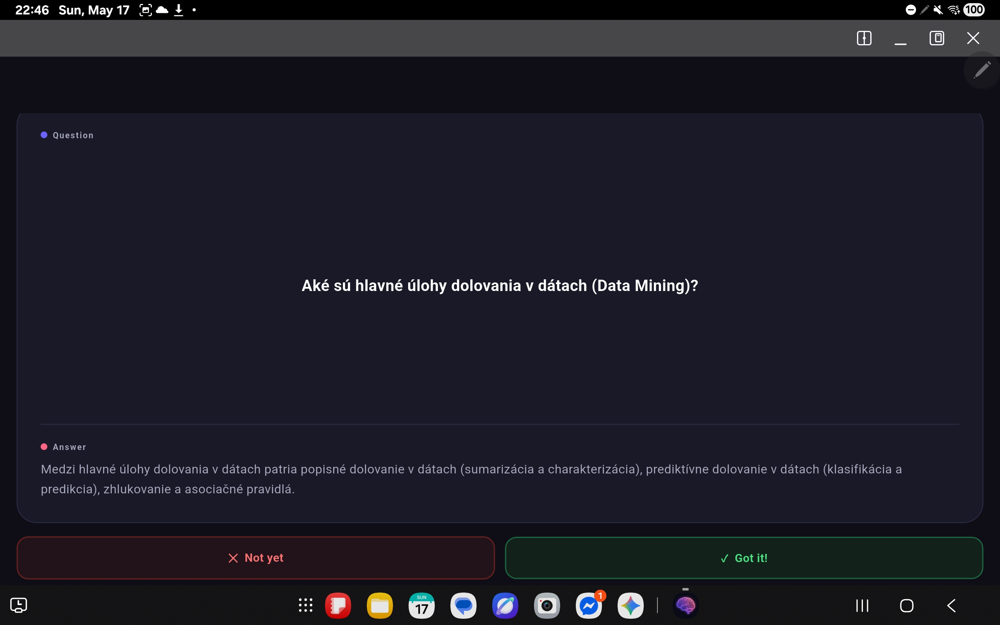
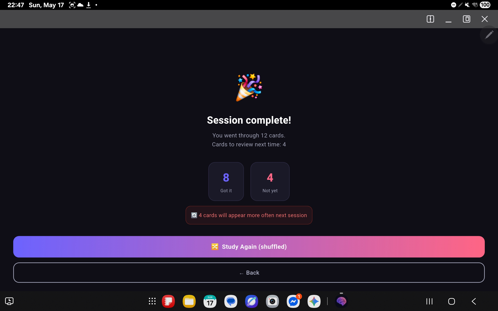
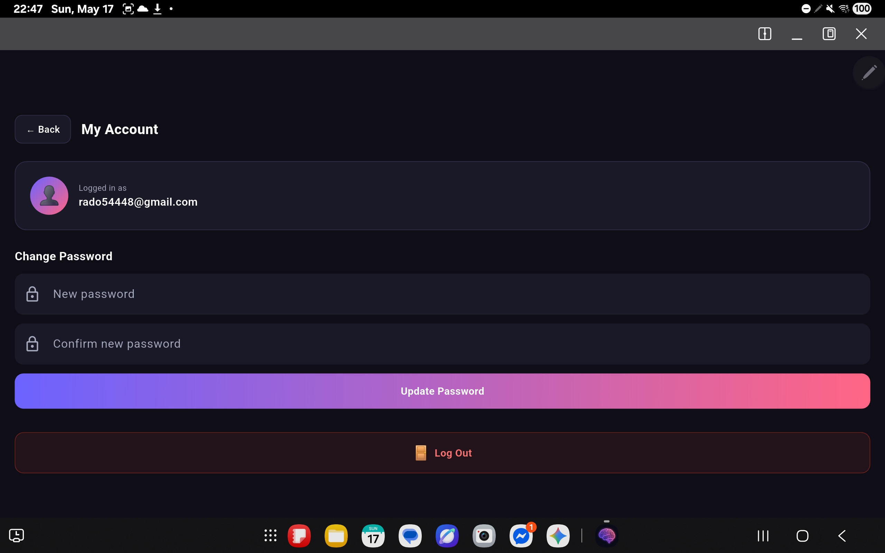

# 🧠 FlashAI — AI Generátor Flashkariet

FlashAI je mobilná aplikácia vytvorená vo Flutter, ktorá využíva umelú inteligenciu Google Gemini na automatické generovanie študijných flashkariet z nahratých dokumentov, prezentácií alebo fotografií.
---

## Screenshoty

| Hlavná obrazovka | Vygenerované karty |
|  |  |

| Study mode | Výsledky |
|  |  |

| Uložené sety | Účet |
|  | !
[sety](docs/screenshots/Screenshot_20260517_224744.jpg) |

---

## Funkcie

- **Nahranie súboru** — podporuje PDF, DOCX, PPTX, TXT, MD, CSV
- **Fotografie** — odfotiť až 10 fotografií ručne písaných poznámok
- **AI generovanie** — Google Gemini automaticky generuje flashkarty
- **Výber jazyka** — generovanie kariet v 10 jazykoch (slovenčina, angličtina, nemčina atď.)
- **Počet kariet** — výber od 5 do 20 kariet pomocou slidera
- **Kliknutím odhaliť** — kliknutím na kartu sa zobrazí odpoveď
- **Study mode** — prechádzanie kartami, označenie Vedel som / Nevedel som
- **Spaced repetition** — karty s ktorými máš problém sa objavujú častejšie
- **Zamiešanie** — karty sa zamiešajú pri každom novom štúdiu
- **Cloudové ukladanie** — uloženie setov flashkariet do Firebase Firestore
- **Používateľské účty** — registrácia a prihlásenie cez email a heslo
- **Bezpečný backend** — API kľúč nie je nikdy vystavený v aplikácii

---

## Architektúra

```
FlashAI (Flutter mobilná aplikácia)
    │
    ├── Firebase Auth       → prihlásenie / registrácia používateľov
    ├── Firebase Firestore  → cloudové ukladanie flashcard setov
    │
    └── Vercel Server (Node.js)
            │
            └── Google Gemini API  → AI generovanie flashkariet
```

Aplikácia nikdy nevolá Gemini API priamo — všetky požiadavky prechádzajú cez bezpečný Vercel server, ktorý drží API kľúč.

---

## Použité technológie a knižnice

### Frontend (Flutter / Dart)
| `firebase_core` | Inicializácia Firebase |
| `firebase_auth` | Autentifikácia používateľov |
| `cloud_firestore` | Cloudová databáza |
| `file_picker` | Nahrávanie súborov |
| `image_picker` | Prístup ku kamere a galérii |
| `syncfusion_flutter_pdf` | Extrahovanie textu z PDF |
| `archive` + `xml` | Extrahovanie textu z DOCX a PPTX |
| `provider` | Správa stavu aplikácie |
| `http` | Komunikácia s API |

### Backend (Node.js / Vercel)
| Node.js | Runtime prostredie |
| Vercel Serverless Functions | Hosting a nasadenie |
| Google Gemini API | AI spracovanie textu a obrázkov |

---

## Návod na spustenie

### Požiadavky
- Flutter SDK (>=3.0.0)
- Android zariadenie alebo emulátor

### Spustenie

**1.** Klonuj repozitár:
```bash
git clone https://github.com/Nikhate/AI-flashcards.git
cd AI-flashcards
```

**2.** Nainštaluj závislosti:
```bash
flutter pub get
```

**3.** Spusti aplikáciu:
```bash
flutter run
```

To je všetko! Firebase aj backend sú už nakonfigurované v repozitári.

---

## Štruktúra projektu

```
AI-flashcards/
├── lib/
│   ├── main.dart                    # Vstupný bod aplikácie, inicializácia Firebase
│   ├── firebase_options.dart        # Firebase konfigurácia
│   ├── models/
│   │   ├── flashcard.dart           # Dátový model flashkarty
│   │   └── flashcard_set.dart       # Dátový model setu flashkariet
│   ├── providers/
│   │   └── home_provider.dart       # Správa stavu (prežije rotáciu)
│   ├── screens/
│   │   ├── auth_screen.dart         # Prihlásenie / Registrácia
│   │   ├── home_screen.dart         # Hlavná obrazovka
│   │   ├── study_screen.dart        # Study mode so spaced repetition
│   │   ├── saved_sets_screen.dart   # Zoznam uložených setov
│   │   └── account_screen.dart      # Správa účtu, zmena hesla
│   ├── services/
│   │   ├── auth_service.dart        # Firebase Auth logika
│   │   ├── gemini_service.dart      # AI API volania cez Vercel
│   │   ├── storage_service.dart     # Firestore čítanie/zápis
│   │   └── file_service.dart        # Extrahovanie textu z PDF, DOCX, PPTX
│   ├── theme/
│   │   └── app_theme.dart           # Farby a ThemeData
│   └── widgets/
│       ├── buttons.dart             # Znovupoužiteľné tlačidlá
│       └── flashcard_tile.dart      # Widget flashkarty s odkrytím
├── assets/
│   └── icon/
│       └── icon.png                 # Ikona aplikácie
├── android/
│   └── app/
│       └── google-services.json     # Firebase konfigurácia pre Android
├── docs/
│   └── screenshots/                 # Screenshoty aplikácie
└── pubspec.yaml                     # Závislosti projektu
```

---

## Reflexia využitia LLM nástrojov

### Použité nástroje

**1. Claude (Anthropic) — vývojový asistent**
Počas vývoja projektu som využíval Claude ako pomocníka pri riešení konkrétnych problémov. 

**2. Google Gemini API — súčasť produktu**
Gemini je priamo integrovaný do aplikácie ako AI engine na generovanie flashkariet. Toto je hlavná LLM funkcionalita produktu samotného.

---

### Ako som využíval Claude pri vývoji

**Generovanie kódu a scaffold**
Na začiatku som vedel čo chcem vytvoriť — AI flashcard aplikáciu vo Flutter. Claude mi pomohol nastaviť základnú štruktúru projektu. Generoval som s jeho pomocou kostru tried a widgetov.

**Ladenie chýb**
Toto bola oblasť kde som Claude využíval najviac. Keď som narazil na chybu — napríklad problémy s CORS pri volaní API z prehliadača, alebo overflow chyby pri rotácii tabletu.

**Architektúra a rozhodnutia**
Pri niektorých architektonických rozhodnutiach som sa radil s Claude — napríklad ako zabezpečiť API kľúč (výsledkom bol Vercel proxy server), alebo ako riešiť stav aplikácie pri rotácii obrazovky (výsledkom bol Provider). 

---

### Prínosy LLM nástrojov

- **Rýchlejšie riešenie problémov** — namiesto hodín hľadania na Stack Overflow som dostal vysvetlenie za minúty
- **Učenie za pochodu** — Claude vysvetlil prečo niečo nefunguje, nielen ako to opraviť. 
- **Iteratívny vývoj** — mohol som rýchlo skúšať rôzne prístupy a dostávať spätnú väzbu

---

### Limity a úskalia

- **Nesprávny kód na prvýkrát** — Claude nie vždy vygeneroval funkčný kód. Niekoľkokrát som musel chyby opraviť sám alebo sa opýtať znova s presnejším popisom problému
- **Zastaranosť** — niektoré návrhy používali staršie API alebo deprecated metódy ktoré už nefungovali v aktuálnej verzii Flutter/Firebase
- **Zaseknutie sa v kruhu** — pri niektorých chybách s Claude chodili v kruhu a riešenie som nakoniec našiel sám alebo inak alebo po viacerých promptoch

---

### Čo som sa naučil

Práca s LLM nástrojmi ma naučila efektívnejšie formulovať problémy — čím presnejší a konkrétnejší som bol v otázke, tým lepšiu odpoveď som dostal. Zároveň som pochopil že AI je najužitočnejší keď mu dám kontext — ukázal som mu kód, chybovú správu
--- 

## Ako používať FlashAI

**1. Registrácia a prihlásenie
Pri prvom spustení sa zobrazí prihlasovacia obrazovka. Klikni na "Don't have an account? Register", zadaj email a heslo (minimálne 6 znakov) a potvrď heslo. Po registrácii si automaticky prihlásený.

**2. Nahranie materiálu
Na hlavnej obrazovke máš dve možnosti — nahrať súbor alebo odfotiť poznámky. Klikni na "Browse" pre nahratie súboru (PDF, DOCX, PPTX, TXT, MD, CSV) alebo na "Snap" pre fotenie poznámok kamerou či výber z galérie. Naraz môžeš nahrať viacero súborov alebo až 10 fotografií.

**3. Nastavenia generovania
Pomocou slidera vyber počet kariet (5 až 20) a z rozbaľovacieho menu vyber jazyk v ktorom chceš mať karty vygenerované.

**4. Generovanie kariet
Po nahratí materiálu klikni na "✨ Generate Flashcards". AI spracuje tvoj materiál a vygeneruje karty — zvyčajne to trvá 5 až 15 sekúnd.

**5. Prezeranie kariet
Vygenerované karty sa zobrazia na obrazovke. Kliknutím na kartu odhalíš odpoveď.

**6. Study mode
Klikni na "🚀 Start Study Mode" pre štúdium. Pri každej karte označ či si ju vedel ("Got it") alebo nie ("Not yet"). Karty ktoré neovládaš sa budú objavovať častejšie vďaka spaced repetition.

**7. Uloženie setu
Klikni na "💾 Save" pre uloženie setu do cloudu. Zadaj názov setu a potvrď. Uložené sety nájdeš po kliknutí na "📚 Saved".

**8. Správa účtu
Klikni na "👤 Account" pre zmenu hesla alebo odhlásenie.

--- 
## Autor

Radovan — študentský projekt pre predmet softvérové inžinierstvo, 2025/2026
